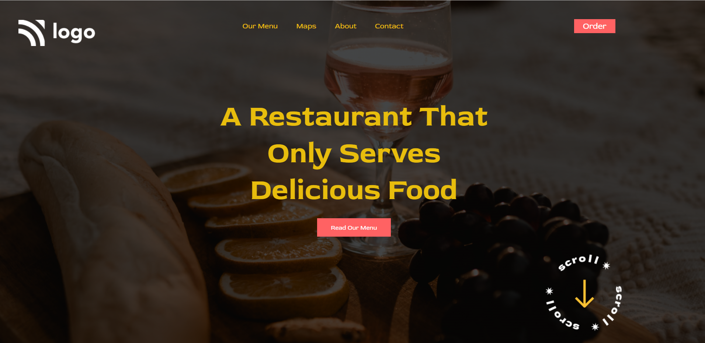

# Project-02- Restaurant Website Template . 
 ## Hey there ,  Shashi
 I have build a template of HTML and CSS project using my core css skills.
 
 
 
 

 My Live Deployed Website Link :- [Click here !](https://project2-shashi.netlify.app/)

 
 

 ## What I have learned in this project .
 - In this project I have learned alout adding an image in background and how I blur that image. .
 
